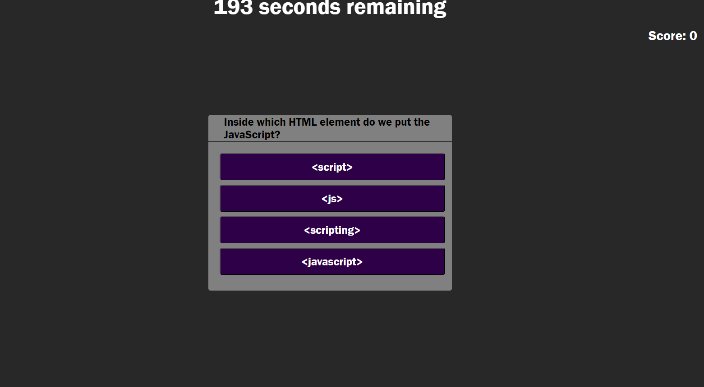

# Coding Quiz

## Activity

- For this activity I created a Javascript Quiz to help Bootcamp students study things we have learned about in class.

## User Instructions

- Hit Start Quiz to begin.
- Read the rules and the directions on the screen to begin the timed JavaScript Quiz.
- Enter your initials at the end to see the high scores and how you compare!

## Screenshot

- Here is a screenshot of the working webpage.

## Working Code

- Here is a link to a working version of my code:
[coding-quiz](https://laurbaur024.github.io/coding-quiz/)